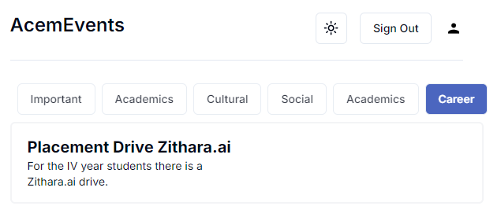
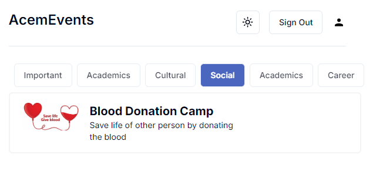
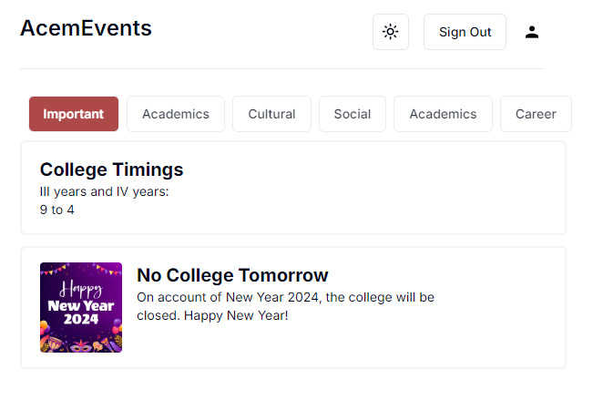

# acemEvents

- A Web app that gives the updates on the events going to occur in an organization (Acem College).
- Updates related to various categories of events.
- Built on top of MERN stack.
- Has Bycrpt to encrypt the passwords (nobody can see it)
- Simple UI using ShadCn

## Supporting Screenshots

- Career Events

  

- Social Events

  

- Important Events

  
